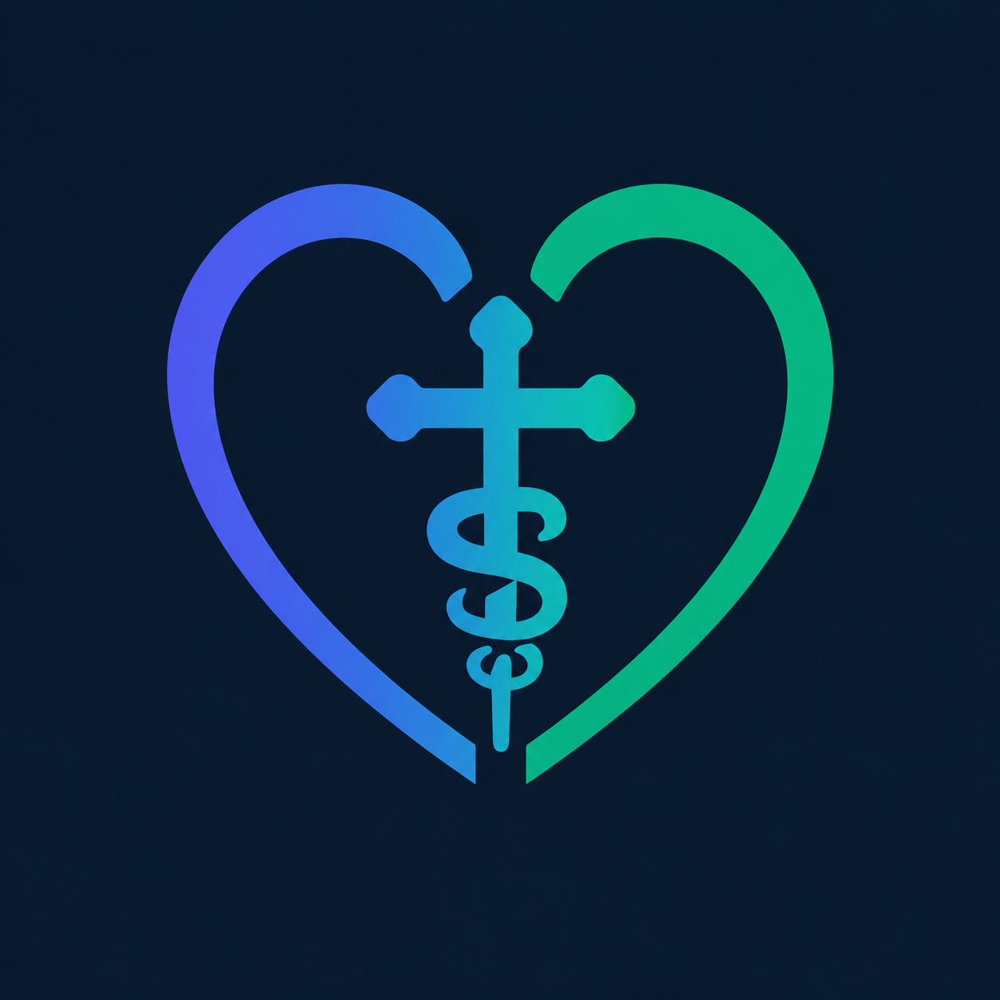
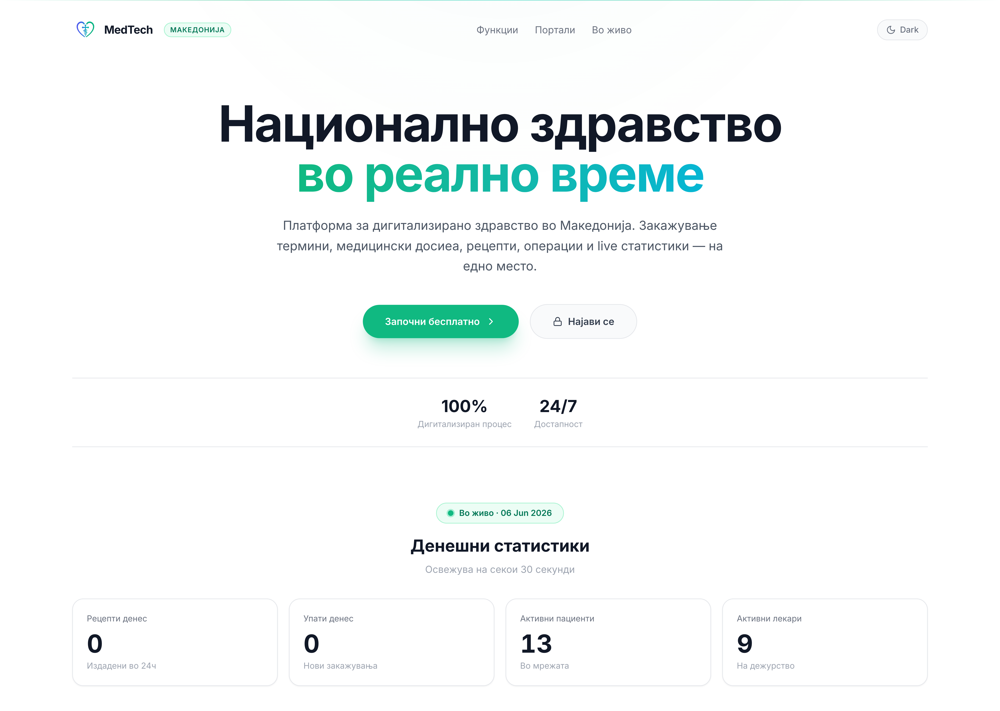
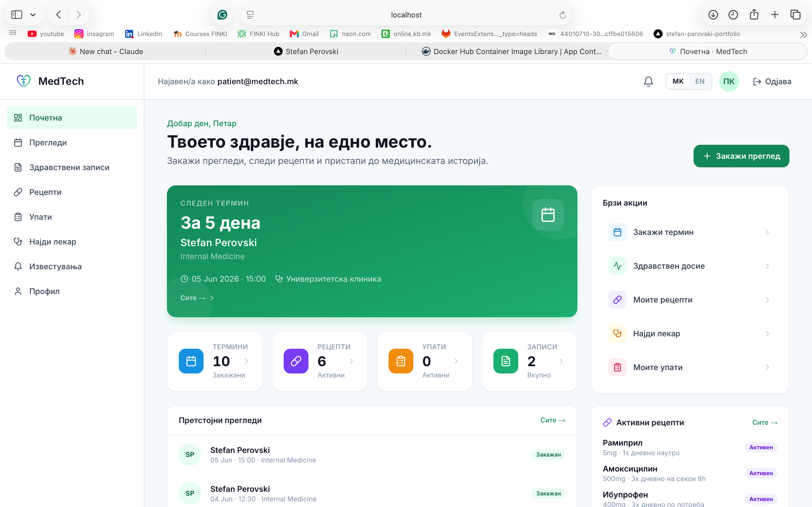
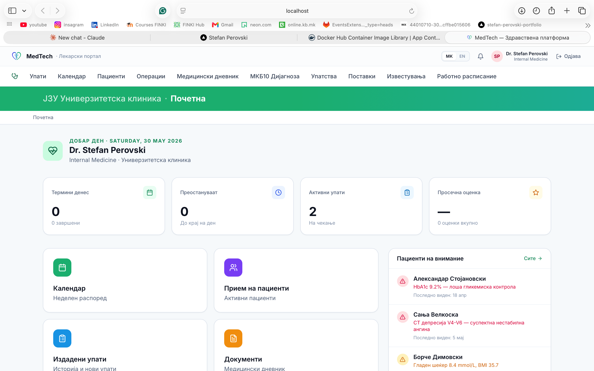
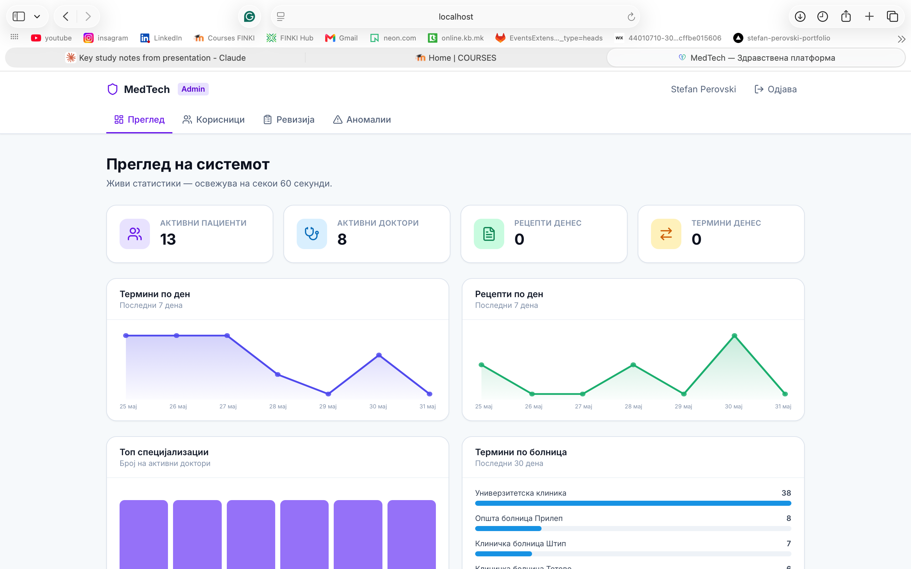

<div align="center">



# MedTech 2.0

**A full-stack digital health platform for North Macedonia**

Appointment booking · Doctor portals · Medical records · Live admin analytics

[](https://github.com/steff221/MedTech2.0/actions/workflows/ci.yml)
[](https://github.com/steff221/MedTech2.0/pkgs/container/medtech-backend)
[](https://github.com/steff221/MedTech2.0/pkgs/container/medtech-frontend)
[](https://openjdk.org/)
[](https://nextjs.org/)
[](https://www.postgresql.org/)

</div>

---

## What is MedTech?

MedTech is a modern healthcare management platform modelled after real clinic workflows in North Macedonia. It connects **patients**, **doctors**, and **administrators** in a single system — from booking your first appointment to generating prescriptions and reviewing national health statistics in real time.

Think of it as the digital backbone of a hospital network: patients can book with any doctor, doctors manage their day through a familiar clinical dashboard, and admins watch live analytics across every hospital.

---

## Screenshots

<table>
  <tr>
    <td align="center"><b>Public Landing</b></td>
    <td align="center"><b>Patient Dashboard</b></td>
  </tr>
  <tr>
    <td></td>
    <td></td>
  </tr>
  <tr>
    <td align="center"><b>Doctor Portal</b></td>
    <td align="center"><b>Admin Panel</b></td>
  </tr>
  <tr>
    <td></td>
    <td></td>
  </tr>
</table>

---

## Quick start — one command

```bash
git clone https://github.com/steff221/MedTech2.0.git
cd MedTech2.0/docker
docker compose up -d --build
```

Then open **http://localhost:3000**

> First build downloads Maven + npm dependencies (~5 min). Every subsequent start takes ~15 seconds.

### Demo accounts

| Who | Email | Password |
|-----|-------|----------|
| Patient | `patient@medtech.mk` | `patient123` |
| Doctor | `stefan@medtech.mk` | `magi1002` |
| Admin | `admin@medtech.mk` | *(see seed file)* |

All demo data is seeded automatically from `backend/src/main/resources/database/mock_seed.sql` — 10 hospitals, 8 doctors, 12 patients, 60+ appointments, 20 prescriptions.

---

## Features by role

### Patient
- **Dashboard** with animated stat tiles and your next appointment front and center
- **Multi-step booking wizard** — pick specialty → doctor → date & time → confirm
- **Doctor directory** — interactive Leaflet map of Macedonia with hospital pins, filterable by specialty and procedure
- **Health records** — chronological timeline with vitals and SOAP notes
- **Prescriptions** — active and historical, with dosage details
- **Referrals** — send and track referrals to other specialists

### Doctor
- **Home** with daily stats: appointments today, pending referrals, patient alerts
- **Weekly calendar** — 7-day grid in 20-minute slots, colour-coded by appointment status with rich hover tooltips
- **Patients panel** — full patient drawer with overview, appointments, records, and prescriptions
- **SOAP notes** with MKB10 / ICD-10 autocomplete across 11 specialties
- **Prescription writer** with live patient allergy warnings
- **Operations log**, sick leave generation, and working schedule management
- **Bi-lingual UI** — toggle between Macedonian and English on every page

### Admin
- **Live system overview** — active patients, doctors, prescriptions, and appointments today
- **7-day charts** for appointments and prescriptions
- **Top specializations** bar chart
- **Appointments by hospital** — ranked list across the whole network
- **User management**, audit log, and anomaly detection tabs
- Stats auto-refresh every 60 seconds

### Public landing
- Animated SVG map of North Macedonia with glowing hospital nodes
- Neural-net data packets flowing between connected hospitals
- Live KPI counters polling the API every 30 seconds
- Dark mode toggle

---

## Tech stack

| Layer | Technology |
|-------|-----------|
| **Backend** | Spring Boot 3.3 · Java 21 · Spring Security · JWT (access + refresh) · JPA/Hibernate · MapStruct |
| **Database** | PostgreSQL 16 · native PG enums · triggers · full-text indexes |
| **Frontend** | Next.js 14 (App Router) · TypeScript (strict) · Tailwind CSS v3.4 · Framer Motion |
| **Data fetching** | TanStack Query · Axios · Zustand (global auth state) |
| **Forms** | React Hook Form · Zod validation |
| **Maps** | Leaflet.js |
| **Testing** | JUnit 5 · Mockito · Spring Security Test (38 tests) |
| **Infra** | Docker Compose · GitHub Actions CI/CD · GHCR image publishing |

---

## Project structure

```
MedTech2.0/
├── backend/                        # Spring Boot 3 + Java 21
│   ├── src/main/java/com/medtech/
│   │   ├── domain/                 # Entities, repositories, value objects
│   │   ├── application/            # Services, DTOs, mappers
│   │   ├── infrastructure/         # Security, config, JWT, audit
│   │   └── presentation/           # REST controllers (38 endpoints)
│   └── src/main/resources/database/
│       ├── medtech_schema_pg.sql   # Full schema — PG enums, triggers, indexes
│       └── mock_seed.sql           # Idempotent demo seed
│
├── frontend/                       # Next.js 14 App Router
│   └── src/
│       ├── app/
│       │   ├── (auth)/             # Login / register
│       │   ├── (patient)/          # Patient portal
│       │   └── doctor/             # Doctor portal
│       ├── components/
│       │   ├── landing/            # Macedonia map, KPI counters
│       │   ├── patient/            # Booking wizard, appointments, map
│       │   └── doctor/             # Calendar, SOAP form, prescription form
│       └── services/               # Axios API clients per resource
│
├── docker/
│   └── docker-compose.yml          # Postgres · pgAdmin · backend · frontend
│
└── .github/workflows/ci.yml        # Tests → build → publish to GHCR
```

---

## CI / CD pipeline

Every push to `main` runs automatically:

```
1. Backend tests      mvn -B test  (38 unit + slice tests)
2. Frontend checks    tsc --noEmit + next build
3. If both pass →     Docker images built in parallel and pushed to GHCR
```

Pull the latest published images directly:

```bash
docker pull ghcr.io/steff221/medtech-backend:latest
docker pull ghcr.io/steff221/medtech-frontend:latest
```

PRs run steps 1–2 only. Images are only published after a merge to `main`.

---

## Useful commands

```bash
# Reset everything (wipe DB, re-seed demo data)
cd docker && docker compose down -v && docker compose up -d

# Run backend locally (keep Postgres in Docker)
cd backend && mvn spring-boot:run

# Run frontend locally
cd frontend && npm run dev

# Run backend tests
cd backend && mvn test
```

---

## Troubleshooting

| Symptom | Fix |
|---------|-----|
| Blank page / 404s on `_next/...` | `cd frontend && rm -rf .next && npm run dev` |
| "Port 8080 in use" | `kill $(lsof -ti:8080)` then retry |
| "container is not running" | `cd docker && docker compose up -d` |
| ClassNotFoundException after backend edits | `cd backend && mvn clean package -DskipTests` then restart |

---

## Environment variables (production)

| Variable | Purpose |
|----------|---------|
| `MEDTECH_DB_URL` | JDBC connection URL |
| `MEDTECH_DB_USER` | Database user |
| `MEDTECH_DB_PASSWORD` | Database password |
| `MEDTECH_SECURITY_JWT_SECRET` | ≥ 32-character HMAC secret — **change before deploying** |

---

<div align="center">

Built with [Claude Code](https://claude.ai/claude-code) · Spring Boot · Next.js · PostgreSQL

</div>
